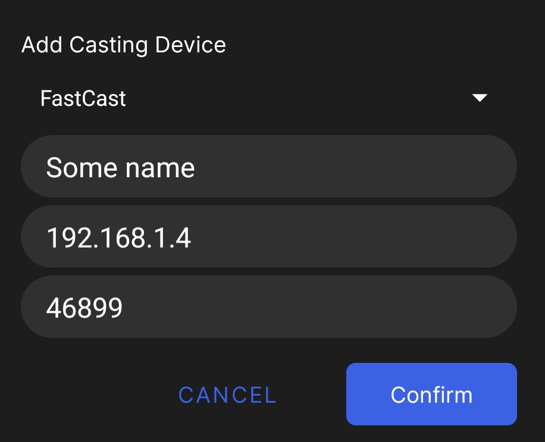

# What is FCast?

FCast is a protocol designed for wireless streaming of audio and video content between devices. Unlike alternative protocols like Chromecast and AirPlay, FCast is an open source protocol that allows for custom receiver implementations, enabling third-party developers to create their own receiver devices or integrate the FCast protocol into their own apps.

# Why do I need a receiver?

The FCast receiver is a working receiver implementation compatible with Linux, Windows and MacOS that supports various stream types such as DASH, HLS and mp4.


# Protocol specification

The protocol specification can be found here https://gitlab.futo.org/videostreaming/fcast/-/wikis/home

# Clients

# Receivers

There are currently receivers for


1. Download the latest build for your platform from https://gitlab.futo.org/videostreaming/fcast/-/releases or build it yourself by following the build instructions.
2. Unzip the archive at your desired location.
3. Run the FCast receiver.
   - **MacOS:** Run the FCastReceiver application
   - **Linux:** Run the `fcast-receiver` application
   - **Windows:** Run the `fcast-receiver.exe` application
4. You should now have the receiver running on the background. On desktop it will have a tray icon as such allowing you to close the receiver.


# Connecting to the FCast receiver with the video streaming application

## Automatic discovery

1. Open the video streaming application.
2. Open the FCast receiver or restart it.
3. The receiver should now be visible in the casting dialog under "Discovered Devices".
4. If this failed, try manually connecting it. Automatic discovery does not work on all network types.
5. Click start to connect to the device.
6. Start watching content.

## Manual

1. Open the FCast receiver.
2. Find the IP of the device running the receiver.
3. Open the video streaming application.
4. Open the casting dialog.
5. Click add to manually add a device.
6. Select the FCast protocol, enter a descriptive name, the IP you found and port 46899.
7. Click start to connect to the device.
8. Start watching content.



# How to build

# Preparing for build

Run the following commands in the `root` directory.

```
npm install
```

# Building

Run the following commands in the `root` directory.

```
npm run build
```

# Packaging

## Windows

Run the following commands in the `packaging` directory.

```
sh package.sh win32-x64
```

## MacOS ARM64

Run the following commands in the `packaging` directory.

```
sh package-macos.sh darwin-arm64
```

## MacOS x64

Run the following commands in the `packaging` directory.

```
sh package-macos.sh darwin-x64
```

## Linux x64

Run the following commands in the `packaging` directory.

```
sh package.sh linux-x64
```
